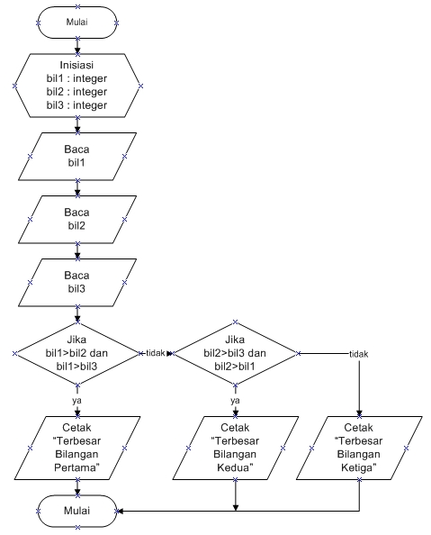
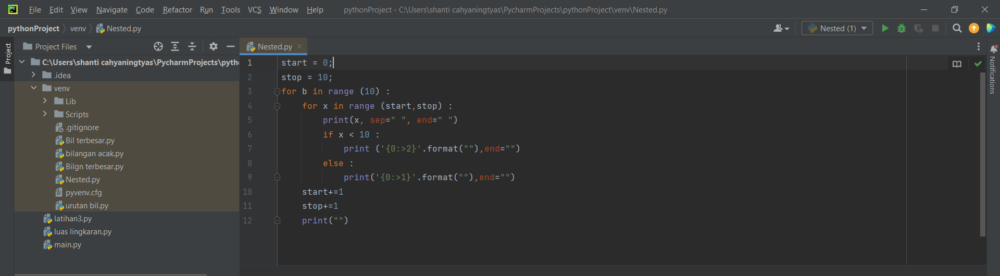

# Labspy02

# PROGRAM MENENTUKAN BILANGAN TERBESAR DARI 3 BUAH BILANGAN
- Solusi yang kita inginkan adalah menggunakan hanya percabangan saja.
- Logikanya simpel karena angkanya hanya terbatas untuk 3 angka
# Bagaimana logikanya?
- Misal kita punya 3 variabel a, b, dan c.
- Kapan variabel b dikatakan yang paling besar?
- Jawabannya adalah:
- Variabel b akan dikatakan yang paling besar, ketika ia lebih besar dari nilai a dan juga lebih besar dari nilai c.
# Persiapan Variabel
Baik, kita mulai langsung dengan menyiapkan 3 buah variabel, yaitu a, b, dan c.
**Ketiga variabel ini kita isi dari inputan user seperti berikut:**
- a = int(input('masukan bilangan ke-1: '))
- b = int(input('masukan bilangan ke-2: '))
- c = int(input('masukan bilangan ke-3: '))
# Mencari Angka Terbesar Antara a, b, dan c
Langkah selanjutnya adalah menulis logika untuk mencari angka terbesar, apakah itu a? b? atau c?
Berikut ini kira-kira implementasi logikanya:

- Lalu kita masukan angka untuk mengisi 3 buah bilangan, setelah itu kita enter maka kita akan tau hasil bilangan yang terbesar seperti dibawah ini

**FLOWCHART DARI PROGRAM DIATAS**
- Berikut adalah gambaran flowchart dari menentukan bilangan terbesar dari 3 buah bilangan

## STRUKTUR KONDISI DAN PERULANGAN
# PENJELASAN LOOPING

- Repository ini menjelaskan tentang **LOOPING** pada program python
- **LOOPING** sendiri artinya perulangan,dalam bahasa pemrograman merupakan suatu pernyataan untuk 
- menguntruksi komputer agar melakukan sesuatu secara berulang.
- Terdapat 2 jenis perulangan dalam bahasa pemrograman *python* ,yaitu perulangan **for** & **while** .
- Dan seperti inilah contoh dari program looping pada python.
# Latihan Perulangan
## MEMBUAT PROGRAM DENGAN PERULANGAN BERTINGKAT 

- Buatlah kodingan Nested for seperti dibawah ini

- Lalu akan keluar hasilnya seperti dibawah ini

# Latihan Struktur Kondisi
## PROGRAM MENGURUTKAN DATA BERDASARKAN INPUT SEJUMLAH DATA
- Buatlah kodingan mengurutkan angka seperti dibawah ini

- Lalu akan keluar hasilnya seperti dibawah ini
